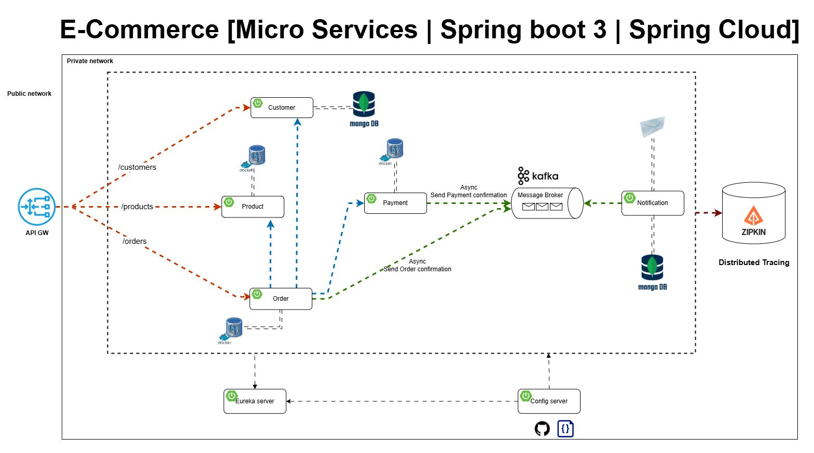
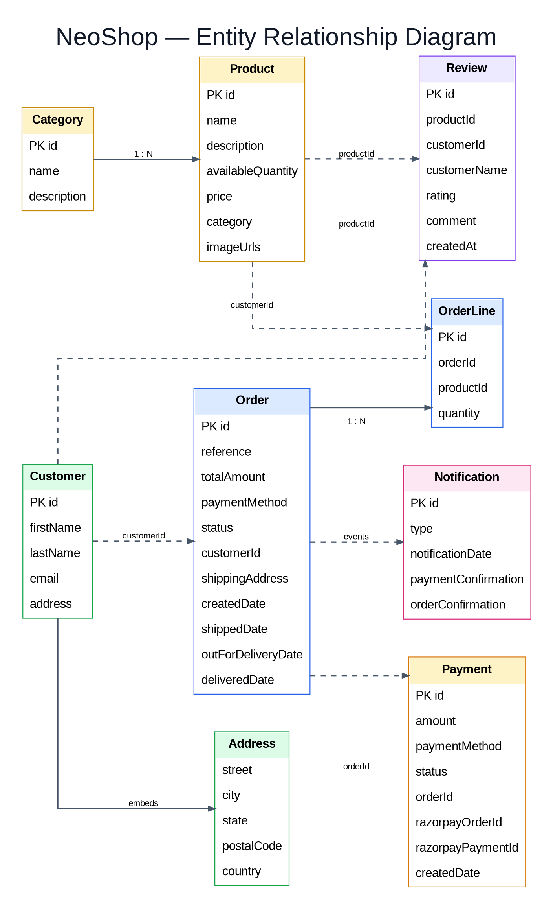
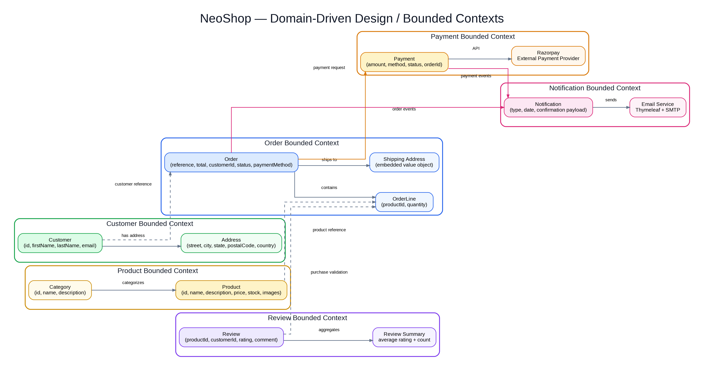

# 🛒 NeoShop — Full-Stack E-Commerce Microservices Platform

<p align="center">
  <b>Spring Boot 3 • Spring Cloud • React • TypeScript • Kafka • PostgreSQL • MongoDB • Keycloak • Docker</b>
</p>

NeoShop is a full-stack e-commerce platform built using a **microservices architecture**. It provides product browsing, authentication, shopping cart, wishlist, checkout, Razorpay/COD payments, order tracking, automated order-status progression, email notifications, reviews, and an admin dashboard.

The backend is built with **Spring Boot 3 and Spring Cloud**, while the frontend uses **React + TypeScript + Vite**.

---

## 📸 Architecture



---

# 🚀 Key Features

## 🛍️ Customer Experience

- Browse products without logging in
- Product categories
- Product search and filtering
- Product details
- Product images
- Shopping cart
- Guest cart
- Automatic guest-cart merge after login
- Wishlist
- Customer profile
- Checkout
- Order placement
- Order history
- Order details
- Order tracking
- Product reviews

---

## 🔐 Authentication & Authorization

NeoShop uses **Keycloak** for authentication and role-based authorization.

### Guest users can:

- Browse products
- View product details
- Search and filter products
- Add products to cart

### Authentication is required for:

- Wishlist
- Checkout
- Placing orders
- My Orders
- Profile
- Reviews
- Protected customer operations

### Admin users can:

- Manage products
- Manage product stock
- Upload product images
- View orders
- Inspect individual orders
- Access the admin dashboard

---

# 📦 Order Management

NeoShop implements an automated order lifecycle.

```text
PENDING
   │
   ▼
CONFIRMED
   │
   ▼
SHIPPED
   │
   ▼
OUT_FOR_DELIVERY
   │
   ▼
DELIVERED
```

During local development, the Order Service scheduler advances the order lifecycle automatically.

The current development configuration runs the scheduler every **10 seconds**, while individual lifecycle transitions are designed around **30-second intervals** for testing.

For production, the scheduler can be changed to a longer interval.

---

# 📧 Order Notifications

Kafka is used for asynchronous order events.

Customers receive email notifications for:

- Order confirmation
- Order shipped
- Order out for delivery
- Order delivered
- Payment confirmation

The Notification Service consumes Kafka events and sends emails through SMTP.

For local development, **MailDev** is used to inspect emails.

---

# 💳 Payment System

NeoShop supports:

### Cash on Delivery

```text
Checkout
   ↓
Order Service
   ↓
Payment Service
   ↓
COD Payment
   ↓
Order Delivered
   ↓
COD Payment Completed
```

### Razorpay

```text
Checkout
   ↓
Order Service
   ↓
Payment Service
   ↓
Razorpay
   ↓
Payment Verification
   ↓
Order Confirmation
```

Supported payment methods:

```text
RAZORPAY
COD
```

---

# 🏗️ System Architecture

NeoShop is composed of independent microservices communicating through REST/Feign and asynchronous Kafka events.

```text
                         ┌─────────────────────┐
                         │    React Frontend   │
                         │ React + TypeScript  │
                         └──────────┬──────────┘
                                    │
                                    ▼
                         ┌─────────────────────┐
                         │    API Gateway      │
                         │      :8222          │
                         └──────────┬──────────┘
                                    │
             ┌──────────────────────┼──────────────────────┐
             │                      │                      │
             ▼                      ▼                      ▼
      Customer Service       Product Service        Order Service
             │                      │                      │
             │                      │             ┌────────┼────────┐
             │                      │             │        │        │
             │                      │             ▼        ▼        ▼
             │                      │          Customer  Product  Payment
             │                      │          Service   Service  Service
             │                      │
             └──────────────────────┴───────────────┐
                                                     │
                                                     ▼
                                                   Kafka
                                                     │
                                                     ▼
                                            Notification Service
                                                     │
                                                     ▼
                                                   Email
```


---

# 🧩 Microservices

## 1. Customer Service

Responsible for:

- Customer information
- Customer profile
- Customer address
- Customer lookup

---

## 2. Product Service

Responsible for:

- Products
- Categories
- Product descriptions
- Product prices
- Product stock
- Product images
- Product purchasing
- Stock restoration

---

## 3. Order Service

Responsible for:

- Creating orders
- Order lines
- Order references
- Order totals
- Payment method
- Order status
- Shipping address
- Order tracking
- Order cancellation
- Order-status scheduler

The Order Service communicates with Customer, Product and Payment services through service-to-service communication.

---

## 4. Payment Service

Responsible for:

- Razorpay order creation
- Razorpay payment verification
- COD payments
- Payment status
- Payment persistence
- Payment confirmation events

---

## 5. Notification Service

Responsible for:

- Kafka consumers
- Notification persistence
- Order confirmation emails
- Payment confirmation emails
- Shipment emails
- Out-for-delivery emails
- Delivery confirmation emails

---

## 6. Review Service

Responsible for:

- Product reviews
- Ratings / feedback
- Order-line validation before review operations

---

# 📨 Kafka Event Architecture

NeoShop uses Apache Kafka for asynchronous communication.

## Order Confirmation

```text
Order Service
      │
      ▼
 order-topic
      │
      ▼
Notification Service
      │
      ▼
Order Confirmation Email
```

## Payment Confirmation

```text
Payment Service
      │
      ▼
payment-topic
      │
      ▼
Notification Service
      │
      ▼
Payment Confirmation Email
```

## Order Status Updates

```text
Order Service
      │
      ▼
order-status-topic
      │
      ▼
Notification Service
      │
      ├──► Shipped Email
      │
      ├──► Out-for-Delivery Email
      │
      └──► Delivered Email
```

---

# 🔄 Order Lifecycle Event Flow

```text
                 ORDER CREATED
                       │
                       ▼
                    PENDING
                       │
             Payment validation
                       │
                       ▼
                  CONFIRMED
                       │
                    30 sec
                       ▼
                   SHIPPED
                       │
                    30 sec
                       ▼
              OUT_FOR_DELIVERY
                       │
                    30 sec
                       ▼
                  DELIVERED
                       │
                       ▼
             COD PAYMENT COMPLETED
```

For Razorpay orders, the Order Service waits for a completed payment before moving the order from `PENDING` to `CONFIRMED`.

For COD orders, the order can be confirmed immediately.

---

# 🗄️ Database Architecture

NeoShop uses a combination of relational and document databases.

## PostgreSQL

Used for relational business data such as:

- Products
- Categories
- Orders
- Order lines
- Payments
- Customer data where configured

## MongoDB

Used for document-oriented notification data.

The services communicate through APIs and events rather than relying on cross-service database joins.

---

# 📊 Entity Relationship Diagram




---

# 📐 Domain-Driven Design

NeoShop is organized around independent business domains.




### Bounded Contexts

```text
Customer Context
        │
        ├── Customer
        └── Address

Product Context
        │
        ├── Product
        ├── Category
        ├── Stock
        └── Product Images

Order Context
        │
        ├── Order
        ├── OrderLine
        ├── Order Status
        └── Shipping Address

Payment Context
        │
        ├── Razorpay
        ├── COD
        └── Payment Status

Review Context
        │
        ├── Reviews
        └── Ratings

Notification Context
        │
        ├── Kafka Consumers
        ├── Email
        └── Notifications
```

---

# 🔐 Security Architecture

Keycloak provides authentication and authorization.

```text
User
 │
 ▼
Frontend
 │
 ▼
Keycloak
 │
 ▼
JWT Access Token
 │
 ▼
API Gateway
 │
 ▼
Protected Microservices
```

The Gateway validates authentication and applies role-based access rules.

---

# 🔭 Observability

NeoShop integrates **Zipkin** for distributed tracing.

```text
Frontend
   │
   ▼
API Gateway
   │
   ▼
Microservices
   │
   ▼
Zipkin
```

This allows requests to be traced across the distributed system.

---

# 🐳 Containerized Infrastructure

Docker Compose is used for local infrastructure.

The environment includes components such as:

- PostgreSQL
- MongoDB
- Kafka
- Zookeeper
- Keycloak
- MailDev
- Zipkin

Start the infrastructure:

```bash
docker compose up -d
```

Check containers:

```bash
docker compose ps
```

Stop containers:

```bash
docker compose down
```

View logs:

```bash
docker compose logs -f
```

---

# 🖥️ Frontend

The frontend is built using:

- React
- TypeScript
- Vite
- React Router
- Keycloak JS
- CSS
- REST APIs

### Frontend structure

```text
frontend/
│
├── public/
│
├── src/
│   ├── auth/
│   ├── context/
│   ├── pages/
│   ├── services/
│   ├── assets/
│   ├── App.tsx
│   ├── main.tsx
│   └── index.css
│
├── package.json
├── package-lock.json
└── vite.config.ts
```

---

# 📁 Project Structure

```text
NeoShop/
│
├── diagrams/
│   ├── architecture-diagram.jpeg
│   ├── architecture-diagram-updated.png
│   ├── ERD.jpeg
│   ├── ERD-updated.png
│   ├── DDD.jpeg
│   ├── DDD-updated.png
│   └── micro-services.drawio
│
├── frontend/
│   ├── public/
│   ├── src/
│   ├── package.json
│   └── vite.config.ts
│
├── services/
│   ├── config-server/
│   ├── discovery/
│   ├── gateway/
│   ├── customer/
│   ├── product/
│   ├── order/
│   ├── payment/
│   ├── notification/
│   └── review/
│
├── resources/
├── docker-compose.yml
├── start-neoshop.bat
├── README.md
└── .gitignore
```

---

# ⚙️ Technology Stack

## Frontend

- React
- TypeScript
- Vite
- React Router
- Keycloak JS

## Backend

- Java
- Spring Boot 3
- Spring Cloud
- Spring Data JPA
- Spring Data MongoDB
- Spring Cloud Gateway
- Spring Cloud Config
- Spring Cloud OpenFeign
- Eureka

## Messaging

- Apache Kafka
- Spring Kafka

## Security

- Keycloak
- OAuth 2.0 / OpenID Connect
- JWT

## Databases

- PostgreSQL
- MongoDB

## Payments

- Razorpay
- Cash on Delivery

## Observability

- Zipkin
- Distributed tracing

## Infrastructure

- Docker
- Docker Compose
- GitHub Actions

---

# 🌐 Local Service Ports

| Component | Port |
|---|---:|
| React Frontend | `5173` |
| API Gateway | `8222` |
| Config Server | `8888` |
| Eureka Server | `8761` |
| Product Service | `8050` |
| Payment Service | `8060` |
| Order Service | `8070` |
| Notification Service | `8040` |
| Keycloak | `9098` |
| Zipkin | `9411` |
| MailDev | `1080` |

---

# 🛠️ Prerequisites

Install:

- Java 17+
- Maven
- Node.js
- npm
- Docker Desktop
- Git

---

# 🚀 Running NeoShop Locally

## 1. Clone the repository

```bash
git clone <YOUR_GITHUB_REPOSITORY_URL>
cd NeoShop
```

---

## 2. Configure environment variables

Create a `.env` file in the project root.

Example:

```env
RAZORPAY_KEY_ID=your_razorpay_test_key
RAZORPAY_KEY_SECRET=your_razorpay_test_secret
```

> Never commit `.env` to GitHub.

---

## 3. Start infrastructure

```bash
docker compose up -d
```

Verify:

```bash
docker compose ps
```

---

## 4. Start Config Server

```bash
cd services/config-server
mvn spring-boot:run
```

---

## 5. Start Eureka Server

```bash
cd services/discovery
mvn spring-boot:run
```

---

## 6. Start Customer Service

```bash
cd services/customer
mvn spring-boot:run
```

---

## 7. Start Product Service

```bash
cd services/product
mvn spring-boot:run
```

---

## 8. Start Payment Service

```bash
cd services/payment
mvn spring-boot:run
```

---

## 9. Start Order Service

```bash
cd services/order
mvn spring-boot:run
```

---

## 10. Start Notification Service

```bash
cd services/notification
mvn spring-boot:run
```

---

## 11. Start Review Service

```bash
cd services/review
mvn spring-boot:run
```

---

## 12. Start API Gateway

```bash
cd services/gateway
mvn spring-boot:run
```

---

# 🖥️ Start Frontend

```bash
cd frontend
npm install
npm run dev
```

Open:

```text
http://localhost:5173
```

The API Gateway runs at:

```text
http://localhost:8222
```

---

# 📧 Email Testing

MailDev is used for local email testing.

Open:

```text
http://localhost:1080
```

You can inspect:

- Order confirmation
- Payment confirmation
- Order shipped
- Out for delivery
- Order delivered

---

# 🔍 Distributed Tracing

Open Zipkin:

```text
http://localhost:9411
```

Zipkin can be used to inspect distributed request traces across NeoShop services.

---

# 🧪 Testing

### Backend

From an individual service:

```bash
mvn test
```

### Frontend

```bash
npm run build
```

---

# 📦 Product Management

Admins can manage products from the Admin Dashboard.

Product management includes:

- Product creation
- Product editing
- Product deletion
- Stock updates
- Category assignment
- Product image upload

Product images are exposed through the Product Service.

---

# 🔄 Service Communication

NeoShop uses two primary communication patterns.

### Synchronous communication

Used for operations that require an immediate response.

```text
Order Service
      │
      ├──► Customer Service
      │
      ├──► Product Service
      │
      └──► Payment Service
```

Feign clients and service discovery are used for service-to-service communication.

### Asynchronous communication

Used for notifications and events.

```text
Order / Payment Services
          │
          ▼
        Kafka
          │
          ▼
Notification Service
          │
          ▼
        Email
```

---

# 📈 Future Improvements

- Kubernetes deployment
- Production cloud deployment
- CI/CD pipeline automation
- Horizontal service scaling
- Production Kafka configuration
- Production Keycloak configuration
- Cloud object storage for product images
- Advanced monitoring
- Centralized logging
- Recommendation system
- Analytics dashboard
- Improved automated testing

---

# 🎯 Learning Outcomes

NeoShop demonstrates practical implementation of:

- Microservices architecture
- Domain-driven design
- REST APIs
- Spring Boot
- Spring Cloud
- API Gateway
- Service discovery
- Centralized configuration
- OpenFeign
- Kafka event-driven architecture
- Distributed tracing
- JWT authentication
- Keycloak
- PostgreSQL
- MongoDB
- Docker
- Razorpay integration
- Order lifecycle management
- React
- TypeScript
- CI/CD concepts

---

# 👨‍💻 Author

**Pritam Paul**

Full-Stack Developer

Java • Spring Boot • Node.js • React • TypeScript • Microservices

---

⭐ If you find NeoShop useful, consider giving the repository a star.
